<div align="center">

#  SwarmSim

### A simulation test bench that finds out when a drone swarm breaks, and proves it with numbers


**5 drones · 2 controllers · 12 fault scenarios · 30 seeded trials per case · acceptance criteria fixed before the experiments**

</div>

 **Simulation only.** SwarmSim has no flight hardware, payload, weapons or deployment logic. Every parameter is generic. It exists to test software behaviour under faults.


##  What is SwarmSim?

Imagine five drones flying a square mission in formation. Now break things: one loses GPS, another's radio goes quiet, a third has its motors fail, the wind picks up. **Does the swarm stay safe, and does it still finish the mission?**

SwarmSim answers that question *repeatably*. It simulates the swarm, injects faults on a script, and scores every run against pass/fail rules that were written down **before** any experiment ran. Each scenario runs 30 times with fixed random seeds, so anyone can reproduce every number in this repository.

In one sentence: **it is a unit-test framework for swarm behaviour.**

##  The problem it solves

| Without a test bench | With SwarmSim |
|---|---|
| One lost GPS fix or radio link can cascade into a broken formation or a near-collision | Each fault is injected on purpose, at a known time, and measured |
| "It looked fine in the demo" | 720 seeded trials with confidence intervals |
| No agreed meaning of "acceptable" | Pass/fail rules live in [`criteria/criteria.yaml`](criteria/criteria.yaml), written first |
| Real flight tests are costly and risky | Everything runs on a laptop in about 10 minutes |
| Failsafe logic is trusted on faith | The failsafe state machine is also written in embedded C++ and checked tick for tick against the Python version |

<br>

## 🖥️ Interactive dashboard

Open [`results/dashboard.html`](results/dashboard.html) in any browser. No server, no install. Pick a scenario and a controller, press **Play**, and watch the swarm. Click any event to jump to that moment.
<p align="center">
  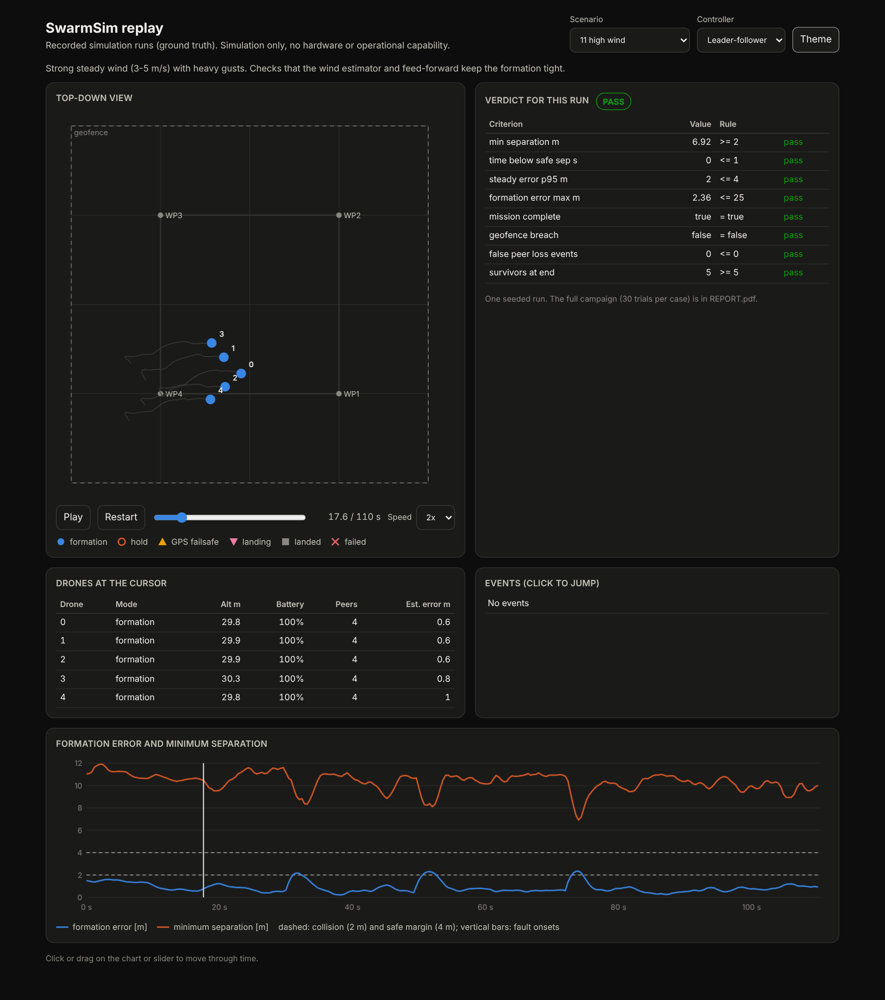
  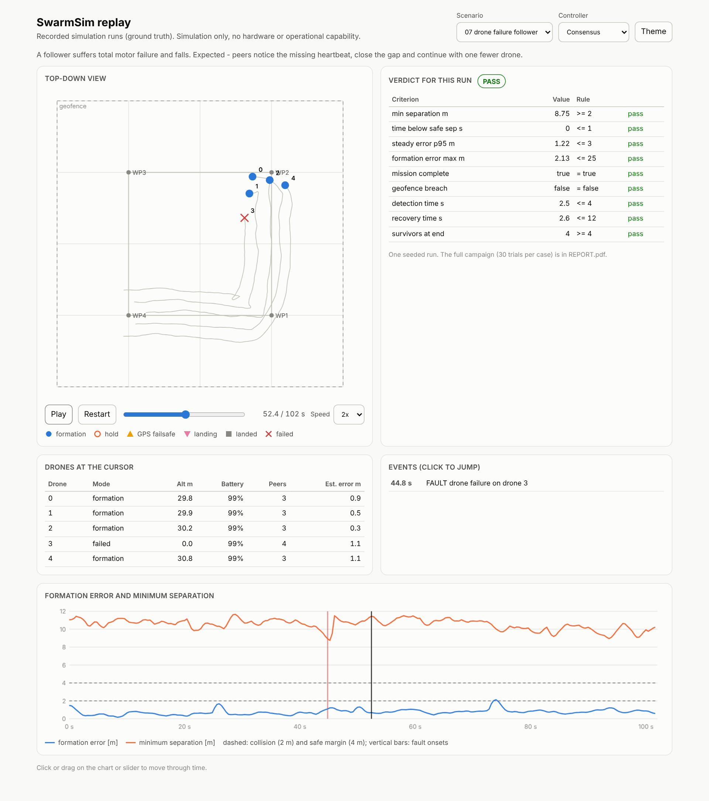
  <br>
  <em>Dashboard replays showing motor failure under consensus control in dark mode (left) and drone failure mode (right).</em>
</p>


<sub>A follower's motors fail at about 45 s. The remaining four drones notice the missing heartbeat in about 2.5 s and carry on. Every criterion shows PASS.</sub>

<details>
<summary><b>More dashboard views</b> (GPS failsafe, wind, dark mode, mobile)</summary>

**GPS dropout on one drone.** The drone loses GPS, switches to FAILSAFE GPS (orange triangle), descends to its own altitude layer, then lands after 10 s. The other four keep flying.

<p align="center">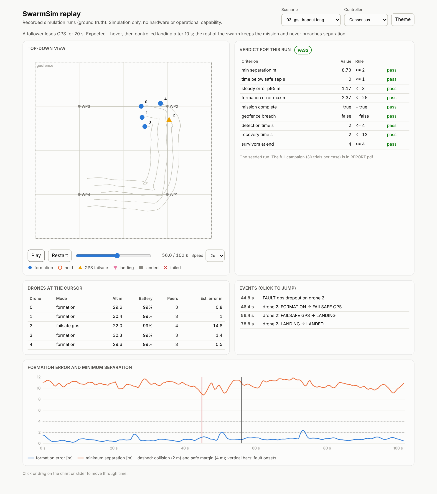
<br>
<em>Dashboard visualization during GPS dropout.</em>
</p>

**Strong wind (3 to 5 m/s).** The formation stays tight in this seed. Across 30 seeds, leader-follower fails 11 of them (see [findings](#-honest-findings-and-open-issues)).

<p align="center">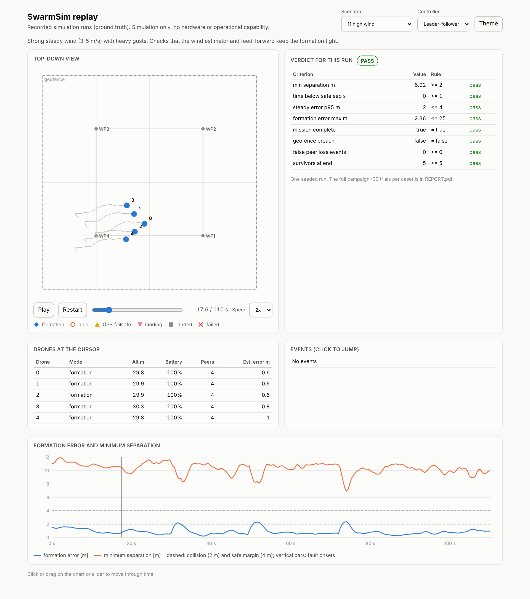
<br>
<em>Dashboard visualization during a high-wind event.</em>
</p>

**Dark mode and mobile.**

<p align="center">
  
  &nbsp;
  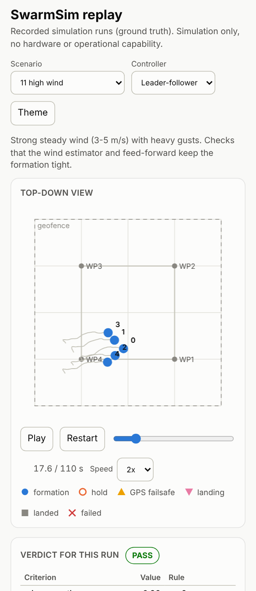
</p>

</details>

**What the dashboard shows**

- A top-down map with the geofence, waypoints, drone trails and a colour and shape per failsafe mode.
- The verdict for the run: every criterion, its measured value and its rule.
- A live table of every drone: mode, altitude, battery, peers heard, estimation error.
- A clickable event log (faults and mode changes).
- A chart of formation error and minimum separation, with the 2 m collision line and 4 m safety margin.

---

## 📄 Test report

[`results/REPORT.pdf`](results/REPORT.pdf) is generated straight from the campaign data. It contains the setup, the pass-rate figure, separation and recovery results, the ablation study, findings written from the numbers, diagnostics, and a limitations section.

<p align="center">
  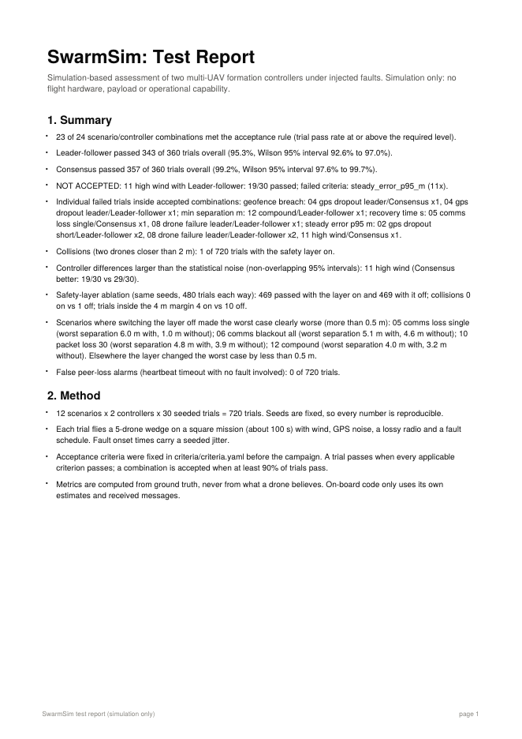
  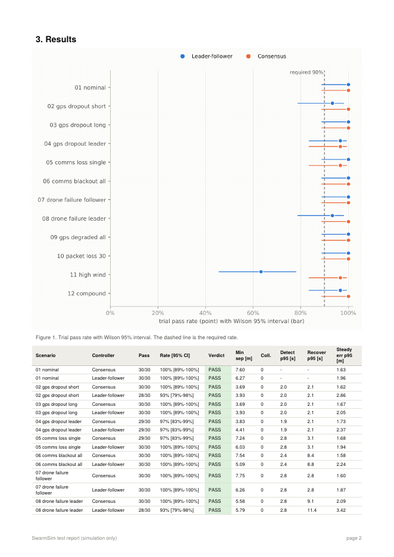
  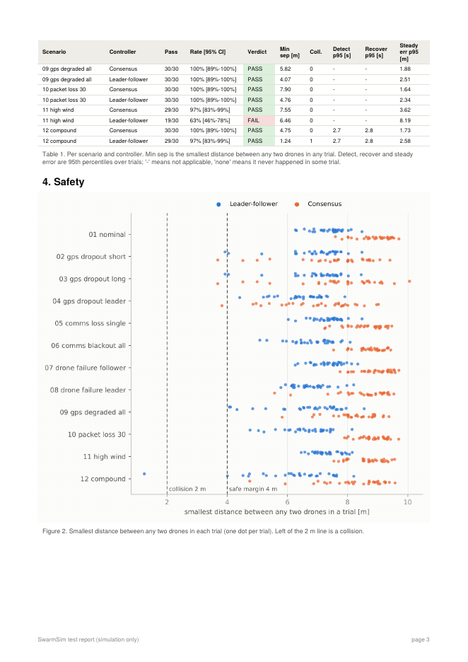
  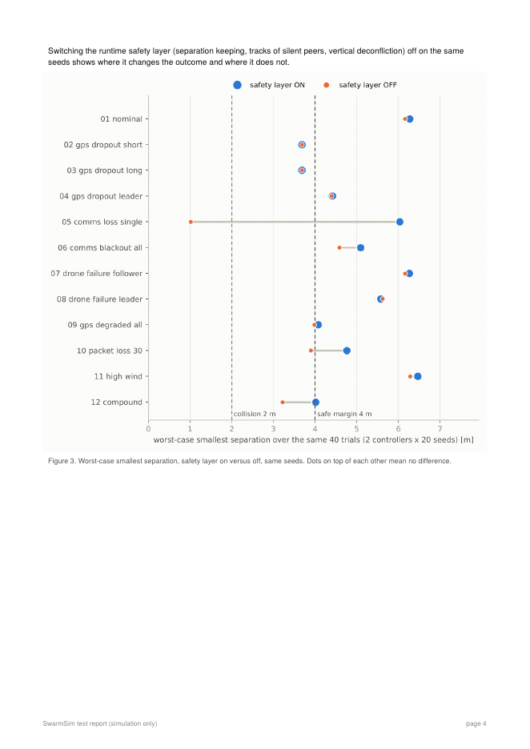
</p>

<p align="center">
  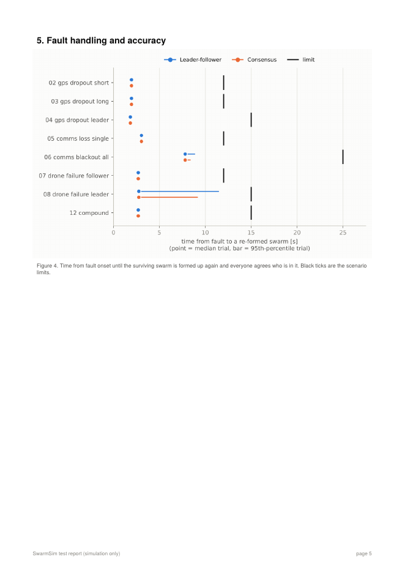
  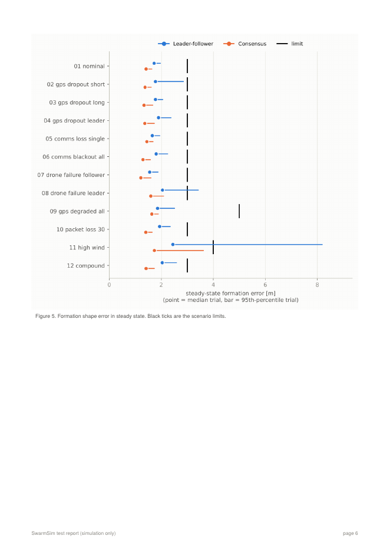
  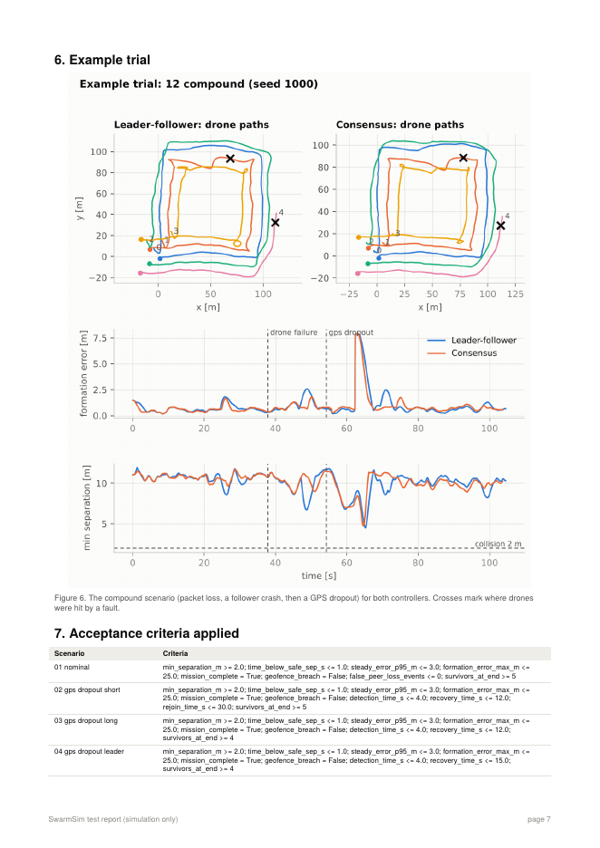
  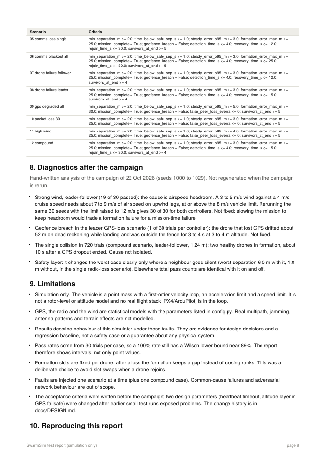
</p>


The individual figures are in [`results/figures/`](results/figures):

| Figure | Shows |
|---|---|
| `pass_rate.png` | Pass rate per scenario and controller, with 95% intervals |
| `separation.png` | Worst-case distance between any two drones |
| `recovery.png` | Fault detection and recovery times |
| `steady_error.png` | Formation shape error once settled |
| `ablation.png` | Safety layer on versus off |
| `example.png` | One annotated run |

</details>

---

## ⚙️ How it works

### 1. The big picture

Everything flows in one direction: define the test, run it many times, score it against the rules, then report.

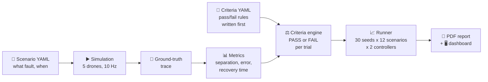
```mermaid
flowchart LR
    A["📝 Scenario YAML<br/>what fault, when"] --> C
    B["📏 Criteria YAML<br/>pass/fail rules<br/>written first"] --> F
    C["▶️ Simulation<br/>5 drones, 10 Hz"] --> D["🧾 Ground-truth<br/>trace"]
    D --> E["📊 Metrics<br/>separation, error,<br/>recovery time"]
    E --> F["⚖️ Criteria engine<br/>PASS or FAIL<br/>per trial"]
    F --> G["📈 Runner<br/>30 seeds x 12 scenarios<br/>x 2 controllers"]
    G --> H["📄 PDF report<br/>+ 🖥️ dashboard"]
```

A key design rule: **metrics read only the ground-truth record, never what a drone believes.** A drone with bad GPS may believe it is in formation while it is actually 15 m off. The test bench sees the truth.

### 2. What happens in one simulation tick (10 times per second)

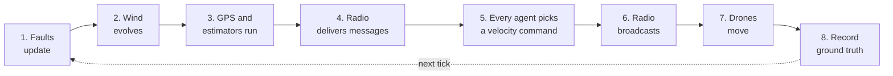
```mermaid
flowchart LR
    T1["1. Faults<br/>update"] --> T2["2. Wind<br/>evolves"]
    T2 --> T3["3. GPS and<br/>estimators run"]
    T3 --> T4["4. Radio<br/>delivers messages"]
    T4 --> T5["5. Every agent picks<br/>a velocity command"]
    T5 --> T6["6. Radio<br/>broadcasts"]
    T6 --> T7["7. Drones<br/>move"]
    T7 --> T8["8. Record<br/>ground truth"]
    T8 -.next tick.-> T1
```

### 3. What runs inside each drone

Every drone carries its own on-board software. Drones only know what their sensors and radio tell them.

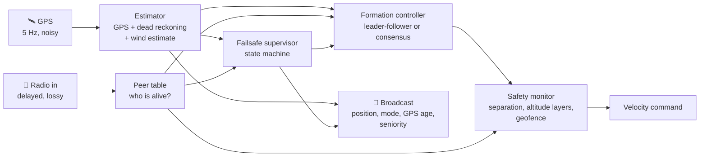
```mermaid
flowchart LR
    GPS["🛰️ GPS<br/>5 Hz, noisy"] --> EST["Estimator<br/>GPS + dead reckoning<br/>+ wind estimate"]
    RADIO["📡 Radio in<br/>delayed, lossy"] --> PEERS["Peer table<br/>who is alive?"]
    EST --> SUP["Failsafe supervisor<br/>state machine"]
    PEERS --> SUP
    EST --> CTRL["Formation controller<br/>leader-follower or consensus"]
    PEERS --> CTRL
    SUP --> CTRL
    CTRL --> SAFE["Safety monitor<br/>separation, altitude layers,<br/>geofence"]
    PEERS --> SAFE
    SAFE --> VEL["Velocity command"]
    EST --> TX["📡 Broadcast<br/>position, mode, GPS age,<br/>seniority"]
    SUP --> TX
```

| Part | Plain-language job |
|---|---|
| **Estimator** | Combines noisy GPS with dead reckoning. If GPS vanishes, it keeps guessing position from velocity, and the guess slowly drifts. It also estimates the wind. |
| **Peer table** | A list of the other drones and when each was last heard. Silence for more than 2.4 s means "probably lost". |
| **Failsafe supervisor** | Decides the drone's mode from only four numbers (time, radio silence, GPS silence, on-ground flag). Because it is so small, it is also written in C++. |
| **Formation controller** | Computes where this drone should be to hold its slot in the formation. |
| **Safety monitor** | Last line of defence. Pushes the drone away from neighbours (including silent ones, with a growing safety bubble), separates altitudes, and keeps it inside the geofence. |

### 4. The failsafe state machine

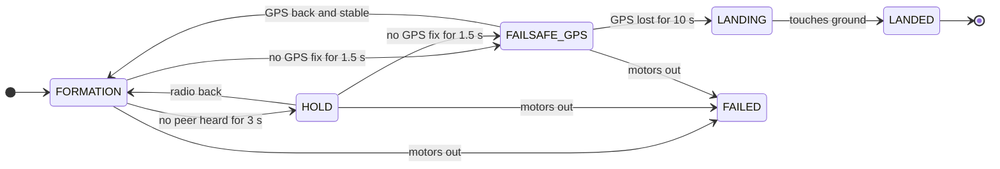
```mermaid
stateDiagram-v2
    direction LR
    [*] --> FORMATION
    FORMATION --> HOLD: no peer heard for 3 s
    HOLD --> FORMATION: radio back
    FORMATION --> FAILSAFE_GPS: no GPS fix for 1.5 s
    HOLD --> FAILSAFE_GPS: no GPS fix for 1.5 s
    FAILSAFE_GPS --> FORMATION: GPS back and stable
    FAILSAFE_GPS --> LANDING: GPS lost for 10 s
    LANDING --> LANDED: touches ground
    FORMATION --> FAILED: motors out
    HOLD --> FAILED: motors out
    FAILSAFE_GPS --> FAILED: motors out
    LANDED --> [*]
```

`LANDING` is **latched**: once a drone commits to landing it never climbs back into the formation, which avoids flip-flopping near other drones.

### 5. Two ways to keep a formation

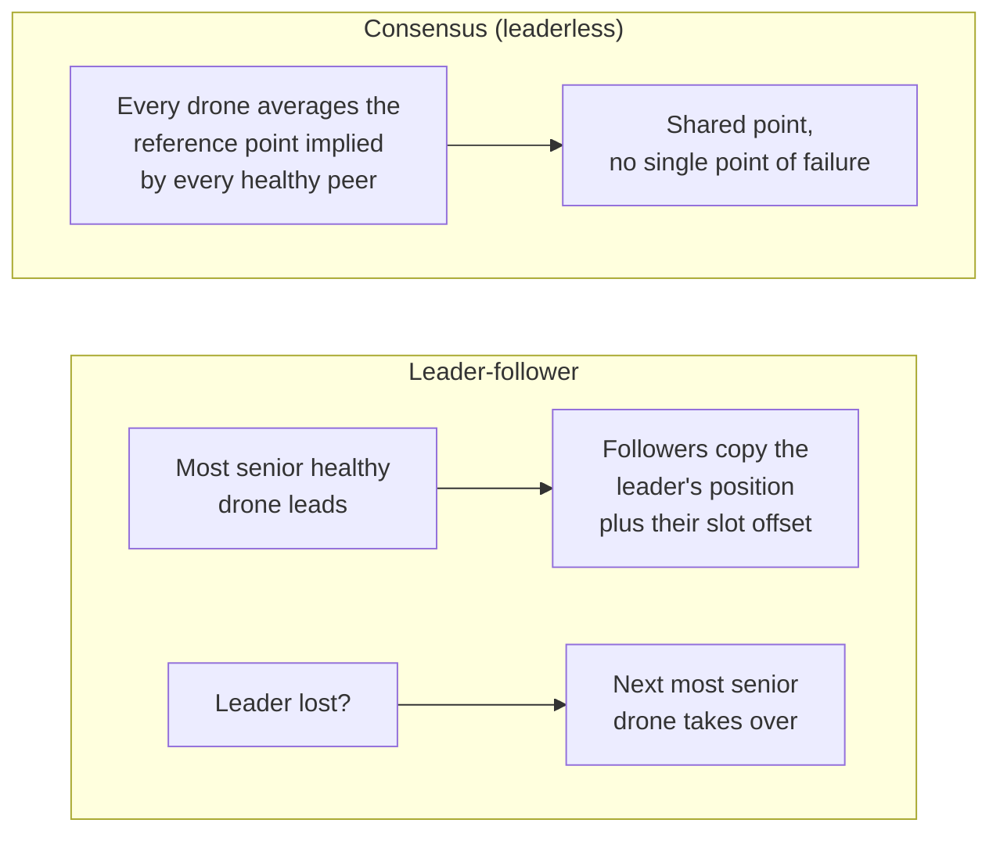
```mermaid
flowchart LR
    subgraph LF["Leader-follower"]
        direction LR
        L["Most senior healthy<br/>drone leads"] --> F1["Followers copy the<br/>leader's position<br/>plus their slot offset"]
        L2["Leader lost?"] --> L3["Next most senior<br/>drone takes over"]
    end
    subgraph CS["Consensus (leaderless)"]
        direction LR
        P["Every drone averages the<br/>reference point implied<br/>by every healthy peer"] --> S["Shared point,<br/>no single point of failure"]
    end
```

Both use **fixed home slots**: each drone owns one position in the formation. A lost drone leaves a gap rather than reshuffling the others, and a returning drone flies back to its own slot. This removed the mid-air crossings seen in early tests.

### 6. What a fault looks like, step by step

An example: a follower's motors fail.

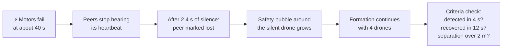
```mermaid
flowchart LR
    X1["⚡ Motors fail<br/>at about 40 s"] --> X2["Peers stop hearing<br/>its heartbeat"]
    X2 --> X3["After 2.4 s of silence:<br/>peer marked lost"]
    X3 --> X4["Safety bubble around<br/>the silent drone grows"]
    X4 --> X5["Formation continues<br/>with 4 drones"]
    X5 --> X6["Criteria check:<br/>detected in 4 s?<br/>recovered in 12 s?<br/>separation over 2 m?"]
```

### 7. Fault types the injector supports

| Fault | What it does |
|---|---|
| `gps_dropout` | A drone's GPS disappears for a set time |
| `gps_noise` | GPS accuracy degrades |
| `comms_loss` | One drone, or all, lose the radio |
| `drone_failure` | Total motor failure; the drone falls |
| `packet_loss` | A share of all radio messages are dropped |

Onset times get seeded jitter, so each trial hits the fault at a slightly different moment of the mission.

### 8. How the verdicts are decided

A single trial **passes** only when every applicable rule holds. A scenario and controller combination is **accepted** when at least 90% of its 30 trials pass.

| Rule | Limit |
|---|---|
| Minimum separation (hard safety) | at least 2 m, always |
| Time below the 4 m safety margin | at most 1 s |
| Formation error once settled (95th percentile) | at most 3 m (4 m in strong wind) |
| Formation error at any moment | at most 25 m |
| Mission completed | yes |
| Geofence breach | none |
| Fault detection time (fault scenarios) | at most 4 s |
| Recovery time (fault scenarios) | scenario-specific |
| False peer-loss alarms | none |

Because 30 trials is a small sample, pass rates are reported with **Wilson 95% confidence intervals**. A score of 30 of 30 has a lower bound of about 89%, so it is strong evidence but not proof.

---

##  The 12 fault scenarios

| # | Scenario | What goes wrong |
|---|---|---|
| 01 | Nominal | Nothing. Baseline flight in light wind |
| 02 | GPS dropout, short | One drone loses GPS briefly, then recovers and rejoins |
| 03 | GPS dropout, long | One drone loses GPS for 20 s, holds, then lands |
| 04 | GPS dropout, leader | The leader loses GPS |
| 05 | Comms loss, single | One drone loses its radio |
| 06 | Comms blackout, all | Every drone loses the radio |
| 07 | Drone failure, follower | A follower's motors fail |
| 08 | Drone failure, leader | The leader's motors fail |
| 09 | GPS degraded, all | Every drone gets noisy GPS |
| 10 | Packet loss 30% | A third of all radio messages vanish |
| 11 | High wind | Steady 3 to 5 m/s wind with heavy gusts |
| 12 | Compound | Several faults overlap |

Scenario files live in [`scenarios/`](scenarios) as plain YAML. Adding your own takes a few lines:

```yaml
name: my_test
description: A follower loses its motors.
faults:
  - {type: drone_failure, drone: 3, t: 40.0, t_jitter: 5.0}
criteria:
  detection_time_s: {max: 4.0}
  recovery_time_s: {max: 12.0}
```

---

## 📊 Results

Campaign of 22 Oct 2026: **720 trials** (12 scenarios × 2 controllers × 30 seeds) plus **480 ablation trials**. Seeds 1000 to 1029.

| | Result |
|---|---|
| Combinations accepted (at least 90% pass) | **23 of 24** |
| Consensus | 357 of 360 trials passed |
| Leader-follower | 343 of 360 trials passed |
| Collisions (under 2 m) | **1 in 720 trials** |
| False peer-loss alarms | **0**, even at 30% packet loss |
| Fault detection time (95th percentile) | about 2 to 2.8 s |

<details>
<summary><b>Full pass-rate table (passed trials out of 30)</b></summary>

| Scenario | Leader-follower | Consensus |
|---|:---:|:---:|
| 01 nominal | 30 | 30 |
| 02 GPS dropout, short | 28 | 30 |
| 03 GPS dropout, long | 30 | 30 |
| 04 GPS dropout, leader | 29 | 29 |
| 05 comms loss, single | 30 | 29 |
| 06 comms blackout, all | 30 | 30 |
| 07 drone failure, follower | 30 | 30 |
| 08 drone failure, leader | 28 | 30 |
| 09 GPS degraded, all | 30 | 30 |
| 10 packet loss 30% | 30 | 30 |
| 11 high wind | **19 (not accepted)** | 29 |
| 12 compound | 29 | 30 |

Raw per-trial data is in [`results/trials.csv`](results/trials.csv) and per-case summaries in [`results/summary.json`](results/summary.json).

</details>

### What the ablation shows

With the runtime safety layer **off**, pass counts are the same (469 of 480 both ways). It is a backstop, not a cure-all. Where it clearly helps is the single-drone radio-loss case: worst separation is **6.0 m with** the layer and **1.0 m without**. It also helps slightly in the 06, 09, 10 and 12 scenarios.

---
## 🚀 Quick start

**Requirements:** Python 3.10 or newer (developed and tested on 3.13). A C++ compiler (`g++`) is needed only for the C++ conformance test.

```bash
# 1. Get the code
git clone https://github.com/Saubhagya7dev/SwarmSim.git
cd SwarmSim

# NOTE : Create Virtual environment and then move on to installing dependencies  
# 2. Install dependencies (numpy, matplotlib, pyyaml, reportlab, pillow, pytest)
pip install -r requirements.txt

# 3. Run the 65 tests (about 30 s)
python -m pytest tests -q

# 4. Run one trial and see its verdict and event log
python -m swarmsim one 07 consensus --events

# 5. Try a case that fails (strong wind, leader-follower)
python -m swarmsim one 11 leader_follower --seed 1022
```

### Reproduce the whole study

```bash
make run          # full campaign: 720 trials + ablation, about 10 min on 2 cores
make report       # rebuild results/REPORT.pdf and REPORT.md from the data
make dashboard    # rebuild results/dashboard.html
make quick        # 5-trial smoke campaign, about 1 min
```

Every trial is seeded, so rerunning gives the same numbers.

### Commands at a glance

| Command | Purpose |
|---|---|
| `python -m swarmsim run` | Run the batch campaign |
| `python -m swarmsim one <scenario> <controller>` | Run and score one trial |
| `python -m swarmsim report` | Build the figures and PDF report |
| `python -m swarmsim dashboard` | Build the HTML replay dashboard |

---

##  Feature overview

| Area | What you get |
|---|---|
| **Swarm simulator** | 5 drones with 3-D dynamics, steady wind plus gusts and turbulence, GPS with dead-reckoning fallback, and a radio with range, latency, jitter and packet loss |
| **Two formation controllers** | Leader-follower (with automatic leader election) and leaderless consensus, tested identically |
| **Per-drone failsafe** | A six-state machine: hold, GPS failsafe, latched controlled landing |
| **Runtime safety monitor** | Separation keeping, "ghost" tracking of silent peers, vertical deconfliction, geofence push-back |
| **Fault injector** | GPS dropout, GPS noise, comms loss, drone failure, packet loss, with seeded onset jitter |
| **Evidence engine** | Metrics from ground truth, criteria engine, parallel seeded runner, Wilson 95% confidence intervals |
| **Ablation study** | 480 extra trials with the safety layer switched off, to show what it actually contributes |
| **Embedded C++ port** | Failsafe monitor with no heap and no STL, verified against Python by conformance tests |
| **Reports** | 8-page PDF test report and Markdown copy, generated from the data |
| **Dashboard** | Self-contained HTML replay of 24 recorded runs, dark mode and mobile friendly |
| **Quality** | 65 automated tests, including a mutation check that proves the C++ conformance test catches bugs |
| **Documentation** | Requirements, interface control document, test plan, design notes, demo script |

---


##  Honest findings and open issues

A test bench is only useful if it reports failures. These are real, found by the campaign, and written up in [`docs/DESIGN.md`](docs/DESIGN.md) section 8.

| Finding | What we know |
|---|---|
| **Leader-follower fails in strong wind** (19 of 30) | Cause confirmed: *airspeed headroom*. With 3 to 5 m/s wind against a 4 m/s cruise speed and an 8 m/s limit, drones run out of speed on upwind legs. Raising the limit to 12 m/s gives 30 of 30 for both controllers. It was **not** patched, because slowing the mission would trade a formation failure for a mission-time failure. |
| **1 collision in 720 trials** | Compound faults, leader-follower, seed 1022, 1.24 m. Cause not yet isolated. |
| **1 geofence breach per controller** | GPS dropout on the leader, seed 1024. The landing drone drifted about 52 m on dead reckoning and was outside the fence for 3 to 4 s at 3 to 4 m altitude. |
| **Why consensus beats leader-follower in wind** | Not investigated. The airspeed cause is confirmed; the difference between controllers is an open question. |
| **Seed overlap** | Early tuning used seeds 1000 to 1009, which overlap the first 10 campaign seeds. This is a mild source of optimism and is disclosed in the design notes and test plan. |

Every parameter that was changed after early test runs is listed in the change history in `docs/DESIGN.md`.

---


## 🗂️ Project structure

```text
SwarmSim/
├── swarmsim/              Python package
│   ├── config.py            default parameters, scenario loader
│   ├── drone.py             vehicle dynamics, wind, GPS estimator
│   ├── comms.py             lossy, delayed radio network
│   ├── supervisor.py        per-drone failsafe state machine
│   ├── agent.py             on-board software: peers, safety filter
│   ├── controllers.py       leader-follower and consensus
│   ├── formation.py         slot geometry helpers
│   ├── faults.py            fault injector
│   ├── simulation.py        the 10 Hz loop and ground-truth trace
│   ├── metrics.py           scores computed from ground truth
│   ├── criteria.py          pass/fail engine
│   ├── runner.py            parallel seeded batches, statistics
│   ├── report.py            figures, REPORT.md, REPORT.pdf
│   ├── dashboard.py         self-contained HTML replay
│   └── cli.py               command-line interface
├── scenarios/             12 fault scenarios (YAML)
├── criteria/              acceptance criteria, fixed before the campaign
├── failsafe/              embedded-style C++ monitor and replay harness
├── tests/                 65 tests, incl. Python vs C++ conformance
├── docs/                  requirements, ICD, test plan, design notes, demo script
│   └── images/              screenshots used in this README
├── results/               trials, summaries, figures, report, dashboard
├── Makefile
└── requirements.txt
```

## 📚 Documentation map

| Document | Read it to learn |
|---|---|
| [`docs/REQUIREMENTS.md`](docs/REQUIREMENTS.md) | What the test bench must do |
| [`docs/ICD.md`](docs/ICD.md) | The interfaces between parts, including the radio message format |
| [`docs/TEST_PLAN.md`](docs/TEST_PLAN.md) | How the experiments were designed and judged |
| [`docs/DESIGN.md`](docs/DESIGN.md) | Models, parameters, change history, limitations, open issues |
| [`docs/APPLICATION_SUMMARY.md`](docs/APPLICATION_SUMMARY.md) | One-page summary of the project |
| [`docs/DEMO_SCRIPT.md`](docs/DEMO_SCRIPT.md) | A 3-minute walkthrough |
| [`results/REPORT.pdf`](results/REPORT.pdf) | The full test report |

### The C++ failsafe monitor

[`failsafe/heartbeat_monitor.h`](failsafe/heartbeat_monitor.h) re-implements the failsafe state machine in embedded-style C++: no heap, no STL, fixed-size data. A replay harness feeds recorded simulation traces through both the Python and the C++ version, and the test suite requires **identical mode sequences on every tick**. A mutation check (planting a bug in the C++) confirmed the test really does catch divergence.

---

## ⚠️ Limitations

- **Point-mass physics.** Vehicles are 3-D point masses with a first-order velocity loop, not rotor-level models.
- **No real flight stack.** PX4 and Gazebo were replaced by a self-contained simulator to remove setup risk.
- **Statistical sensors.** GPS and radio are statistical models, not recorded hardware data.
- **Mostly single faults.** One fault at a time, plus one compound scenario.
- **Fixed slots.** After a loss the formation leaves a gap instead of closing ranks.
- **Evidence, not guarantees.** Results describe behaviour in simulation, not real aircraft.

##  Roadmap

- MAVLink bridge to PX4 SITL, replacing `drone.py` behind the same interface
- Close ranks after a drone is lost
- Isolate the cause of the compound-fault collision
- Investigate why consensus tolerates wind better than leader-follower
- Run the C++ monitor on a real microcontroller
- More fault combinations and larger swarms

## ❓ FAQ

<details>
<summary><b>Why not PX4 or Gazebo?</b></summary>
Setup risk. The interfaces are kept narrow, so a MAVLink bridge can replace the vehicle model later.
</details>

<details>
<summary><b>Does 30 of 30 prove the swarm is safe?</b></summary>
No. The 95% lower bound for 30 of 30 is about 89%. That is why intervals are reported next to every pass rate.
</details>

<details>
<summary><b>Why write the criteria before running the experiments?</b></summary>
So the rules cannot be bent to fit the results. The criteria file was fixed first, and anything changed afterwards is listed in the design notes.
</details>

<details>
<summary><b>Why does the safety layer change so little in the ablation?</b></summary>
The formation controllers already keep drones apart in most scenarios. The layer matters when a drone goes quiet or its position estimate drifts, as in the single-drone radio-loss case.
</details>

<details>
<summary><b>Can I add my own scenario?</b></summary>
Yes. Copy a file in <code>scenarios/</code>, change the faults and criteria, and run <code>python -m swarmsim one &lt;your-scenario&gt; consensus --events</code>.
</details>


---

## Made by : 

**Saubhagya Shubham** A B.Tech Computer Science (AI), founder of Dimension, a tech initiative exploring AI-integrated drone systems.
<div align="center">

[GitHub](https://github.com/Saubhagya7dev) · [LinkedIn](https://www.linkedin.com/in/saubhagya-shubham-2b09621b3/) · saubhagya7developer@gmail.com

</div>


Built as a project for a research internship on swarm-drone simulation, analysis and documentation. Simulation only, with no operational content.


<div align="center"><sub>Every number in this README comes from <code>results/summary.json</code> and can be regenerated with <code>make run</code>.</sub></div>